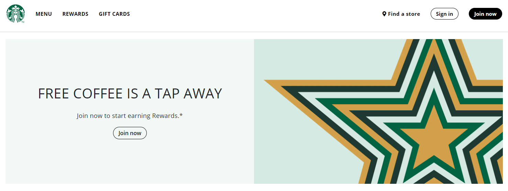

# Cloning Starbucks Webpage Project

## Preview

## About The Project

This is my first cloning webpage constructed using React.js. In this project, I cloned the main page of Starbucks with the thought of assembling Lego blocks called a component in React.js.

## What to be focused on during the project

- First, I tried to carry out the component concept thoroughly by creating components as many as I can.
- Second, I attempted to find out the way to create reusable components for repeated views.
- Third, I kept on looking for something that could be split into another component.
- Lastly, I sought to copy everything up to the smallest thing in order to make users unable to tell it apart which one is real.

## Features

- Mapped objects in a JSON file to compose the main view with a variety of contents.
- Applied separate CSS style on main views by passing props from a parent component into a child component.
- Divided the layout into 4 components for managing each part separately.
- Applied proper CSS effects, such as hovering, for having them emphasized.

## Getting Started

By following the below instruction, you can view the webpage in practice.

1.  Download the code from the repository and extract it.

2.  Open the folder with VSCode.

3.  Open a terminal and install npm modules.

        > npm install

4.  Start the application.

        > npm start
